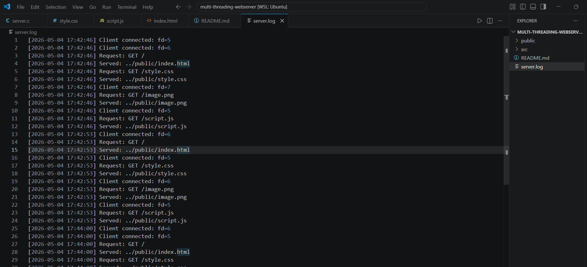

# Multithreaded HTTP Server in C

A high-performance HTTP server built from scratch using C, implementing sockets, thread pools, and concurrency control.

---

## 🔥 Features

- TCP socket-based server
- Thread pool (producer-consumer model)
- Mutex + condition variables
- Static file serving (HTML, CSS, JS, images)
- Proper HTTP response handling
- Logging system with timestamps
- Load handling (503 on overload)

---

## 🧠 Concepts Covered

- Computer Networking (TCP, sockets)
- Operating Systems (threads, synchronization)
- Concurrency Design
- HTTP Protocol

---

## 📂 Project Structure

```
project/
│
├── src/
│   └── server.c
│
├── public/
│   ├── index.html
│   ├── style.css
│   ├── script.js
│   └── test.jpg
│
├── server.log 
├── README.md
└── .gitignore
```
---

## ⚙️ How to Run

```bash
gcc src/server.c -o server -lpthread

./server
```
---

**Open :** http://localhost:8080


---

## 5. Screenshots


- ### Browser output


### Logs
 


---


```markdown
## 🚀 Future Improvements

- epoll-based event-driven architecture
- HTTP keep-alive support
- Load testing and benchmarking
- Zero-copy file transfer (sendfile)
